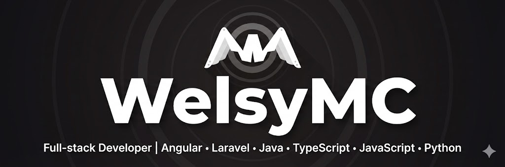

  

<h1 align="center">👋 Salut, je suis WelsyMC</h1>

  <strong>Développeur Full-stack passionné par la création d'applications robustes et scalables.</strong> 
  Basé sur un écosystème moderne alliant performance et flexibilité.

  
  
  
  
  

---

### À propos de moi

Je suis un développeur polyvalent spécialisé dans le développement d'architectures web et logicielles. Mon approche combine la rigueur du **Back-end** (Java, Laravel, Python) avec le dynamisme du **Front-end** (Angular, TypeScript), et du logiciel (Java, Rust).

- Actuellement en train de perfectionner mes compétences en architectures micro-services, et le respect des principes SOLID.
- J'aime transformer des idées complexes en solutions logicielles simples et efficaces.

---

### Stack Technique

| Domaine | Technologies |
| :--- | :--- |
| **Frontend** | Angular, TypeScript, JavaScript (ES6+), Tailwind CSS |
| **Backend** | Laravel (PHP), Java (Spring Boot), Python (FastAPI/Flask/django), JS/TS (express.js) |
| **Logiciel** | Java (Android, Desktop), Python, Rust |
| **Base de données** | MongoDB, MySQL, Redis |
| **Outils & DevOps** | Git, Docker, GitHub Actions (CI/CD+Pipelines) |

---

### Me contacter

  

  Dernière mise à jour : Février 2026

